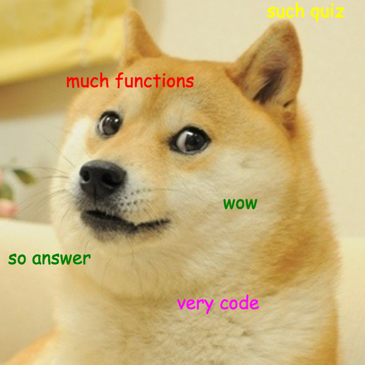
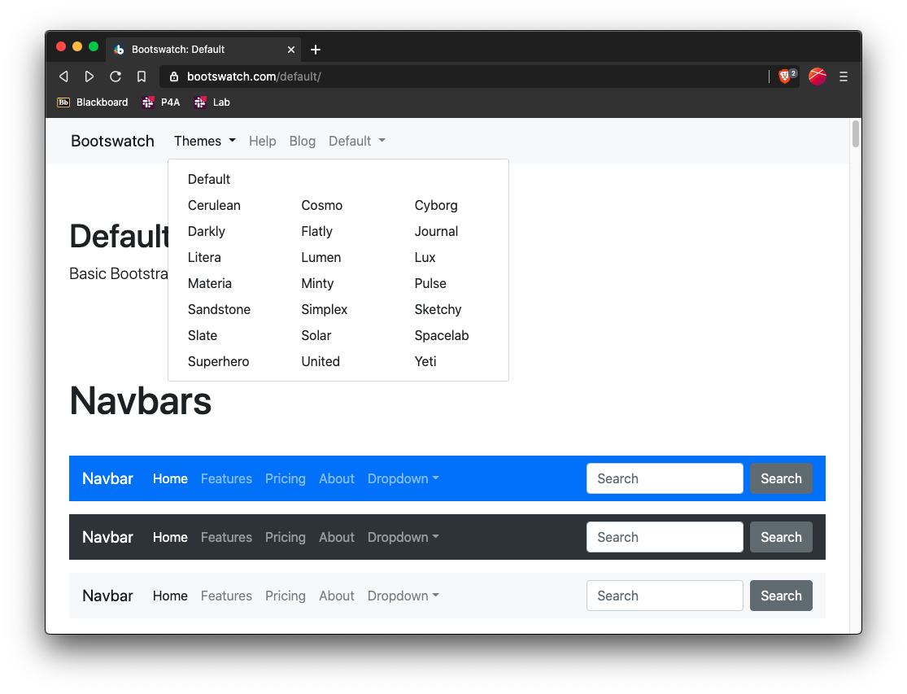
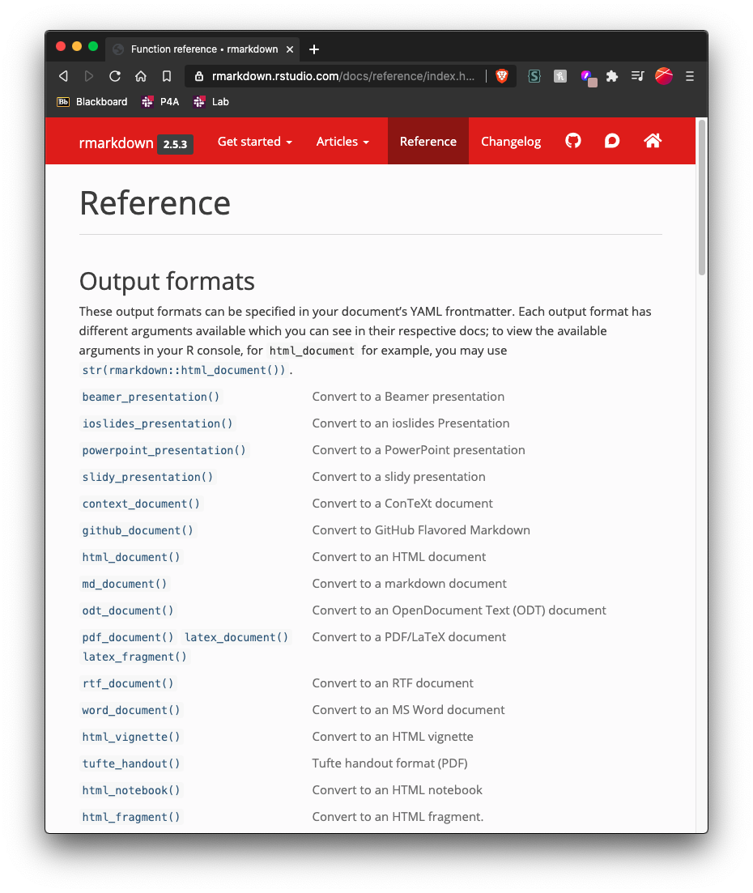
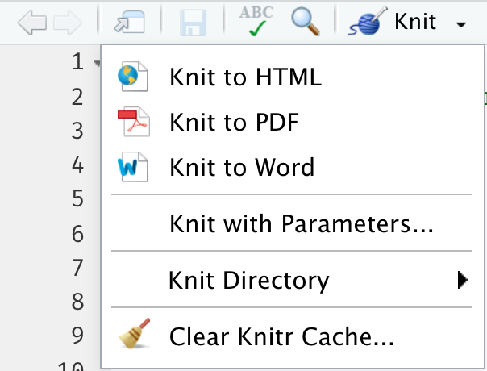
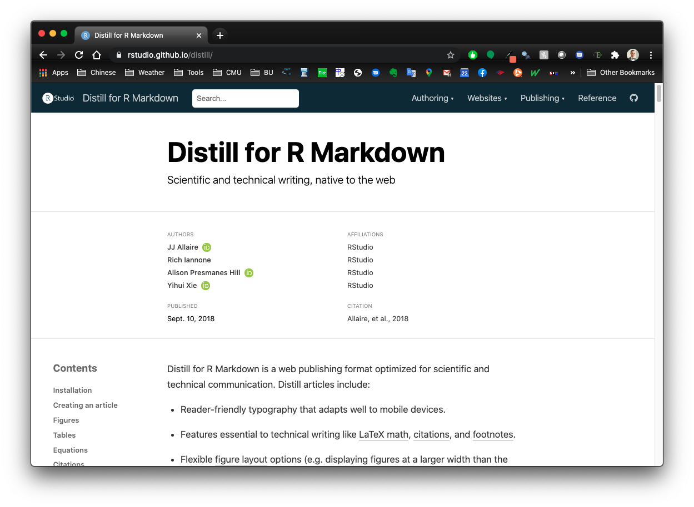

```{r setup, include=FALSE}
source('setup.R')
xaringanExtra::use_tile_view()
```

class: title-slide, middle, inverse

.leftcol30[
<center>

</center>
]
.rightcol70[
# Week 14: .fancy[Reproducible Reporting]

### EMSE 4574: Intro to Programming for Analytics
### John Paul Helveston
### December 01, 2020
]

---

class: inverse

# Quiz 7 (last one!)

```{r, echo=FALSE}
countdown(minutes = 5,
          warn_when = 30,
          update_every = 1,
          bottom = 0,
          left = 0,
          font_size = '4em')
```

.leftcol[
- ### Go to `#classroom` channel in Slack for link
- ### Open up RStudio before you start - you'll probably want to use it.
]
.rightcol[
<center>

</center>
]

---
.center[# (You should always cite your sources)]

.leftcol60[
## A bunch of today's slides are adapted from the brilliant<br>[Alison Presmanes Hill](https://alison.rbind.io/)

### [`r fa(name = "twitter", fill = "#007bff")` @apreshill](http://twitter.com/apreshill)

### Check out her [RMarkdown slide deck](https://apreshill.github.io/rmd4cdc/)
]
.rightcol40[.circle[
<center>

</center>
]]

---
class: inverse, middle

# Week 14: .fancy[Reproducible Reporting]

## 1. Why RMarkdown?
## 2. Metadata and output formats
## 3. Text
## 4. Code chunks

---

class: inverse, middle

# Week 14: .fancy[Reproducible Reporting]

## 1. .orange[Why RMarkdown?]
## 2. Metadata and output formats
## 3. Text
## 4. Code chunks

---
class:center

## The horrors of a non-reproducible workflow

<center>
<iframe width="800" height="500" src="https://www.youtube.com/embed/s3JldKoA0zw" frameborder="0" allowfullscreen></iframe>
</center>

---
class:center

## RMarkdown to the rescue!

<center>
<iframe src="https://player.vimeo.com/video/178485416?color=428bca&title=0&byline=0&portrait=0" width="800" height="500" frameborder="0" webkitallowfullscreen mozallowfullscreen allowfullscreen></iframe>
</center>

---
class: center

# "Literate programming"

.leftcol[.left[
> ### Treat programs as a "literature" understandable to **human beings**
]]
.rightcol[.center[
<center>

</center>
[Donald E. Knuth](https://en.wikipedia.org/wiki/Donald_Knuth)
]]

---

class: inverse, middle

# Week 14: .fancy[Reproducible Reporting]

## 1. Why RMarkdown?
## 2. .orange[Metadata and output formats]
## 3. Text
## 4. Code chunks

---
background-image: url(images/horst_monsters_rmarkdown.png)
background-size: contain
background-color: #FFFFFF

.footnote[Art by [Allison Horst](https://twitter.com/allison_horst?lang=en)]

---
name: card0
background-image: url(images/card0.png)
background-size: contain

.footnote[https://www.dear-data.com/]

---
name: card1
background-image: url(images/card1.png)
background-size: contain

.footnote[https://www.dear-data.com/]

---
background-color: #FFFFFF

.leftcol[
# metadata: YAML

**Y**AML<br>
**A**in't<br>
**M**arkup<br>
**L**anguage

```yaml
---
key: value
---
```
]
.rightcol[.noborder[
```{r echo=FALSE, out.width="75%", fig.align='center'}
knitr::include_graphics("images/orchestra.jpg")
```
]]

---
class: inverse, middle, center

# Output options

---
background-color: #FFFFFF

.leftcol[
# Save output options in your YAML

```{r, echo = FALSE}
yml_empty() %>%
  yml_title("Your title here") %>%
  yml_author("Your name here") %>%
  yml_output(html_document()) %>%
  asis_yaml_output()
```
```{r, echo = FALSE}
yml_empty() %>%
  yml_title("Your title here") %>%
  yml_author("Your name here") %>%
  yml_output(html_document(toc = TRUE,
                           toc_float = TRUE,
                           theme = "flatly")) %>%
  asis_yaml_output()
```
]
.rightcol[.noborder[
```{r echo=FALSE, out.width="75%", fig.align='center'}
knitr::include_graphics("images/orchestra.jpg")
```
]]

---
background-image: url(images/Single-rmd.png)
background-size: contain

---
background-image: url(images/Single-rmd1.png)
background-size: contain

---
background-image: url(images/Single-rmd2.png)
background-size: contain

---
background-image: url(images/Single-rmd3.png)
background-size: contain

---
class: top center

<video width="1530" height="610" controls>
    <source src="images/single-doc-knit.mov"> </video>

---
class: middle center
background-image: url(images/Single-knit1.png)
background-size: contain

???

Here is what we knit.

---
background-image: url(images/Single-knit2.png)
background-size: contain

???

Using the `THEME:` key in our YAML, we changed our font and colors.

---
background-image: url(images/Single-knit3.png)
background-size: contain

???

And we have this nice table of contents floating off to the side...

---
class: center

## Preview bootswatch themes

.noborder[
```{r echo=FALSE, out.width="55%", fig.align='center', fig.link="https://bootswatch.com/default/"}

```
]

https://bootswatch.com/

---
class: inverse

.leftcol[
## Quick check-in

.font90[How do you use only the **default** output options?]

(a)
```yaml
---
output: html_document()
---
```
(b)
```yaml
---
output: html_document
---
```
]

--
.rightcol[
<br><br>
.font90[How do you add an output **option** to a format in your YAML?]

(a)
```yaml
---
output:
  html_document:
    toc: true
---
```

(b)
```yaml
---
output:
  html_document(toc=true)
---
```
]

---
class: inverse, middle, center

# Output formats

---
class: center

.noborder[
```{r echo=FALSE, out.width="42%", fig.align='center', fig.link="https://rmarkdown.rstudio.com/docs/reference/index.html#section-output-formats"}

```
]

https://rmarkdown.rstudio.com/docs/reference/index.html#section-output-formats

---

# `r emo::ji("yarn")` Knit to multiple outputs

```{r, eval=FALSE}
rmarkdown::render("notes.Rmd", output_format ="all")
```

.leftcol[
```{r echo=FALSE, out.width="60%", fig.align="center"}

```

]

.rightcol[
```{r echo=FALSE}
yml_empty() %>%
  yml_title("Your title here") %>%
  yml_author("Your name here") %>%
  yml_output(html_document(toc = TRUE, toc_float = TRUE, theme = "flatly"),
             word_document(),
             pdf_document()
             )  %>%
  asis_yaml_output()
```
]

???

This is a great way to "control" your knit button!

Notice that when you knit, it respects those output options in your YAML.

This way you "save" your output options

---
class: inverse
## Quick check-in

.leftcol[
.font80[How do you add another output **format** to your YAML?

(a)
```yaml
---
output:
  html_document: default
  word_document: default
---
```
(b)
```yaml
---
output:
  html_document()
  word_document()
---
```
]]

--
.rightcol[
.font80[How do you now add output **options** to your YAML?

(a)
```yaml
---
output:
  html_document:
    toc: true
  word_document: default
---
```
(b)
```yaml
---
output:
  html_document(toc=true)
  word_document(default)
---
```
]]

---
class: middle, center
# Built-in output formats

.noborder[
```{r echo=FALSE, out.width="32%", fig.align='center'}
knitr::include_graphics("https://raw.githubusercontent.com/rstudio/hex-stickers/master/PNG/rmarkdown.png")
```
]

---
class: middle

.noborder[
<center>

</center>
]

---
class: middle, center

# Extension output formats

.cols3[.noborder[

]]
.cols3[.noborder[

]]
.cols3[.noborder[

]]

---
class: center

.noborder[
```{r echo=FALSE, out.width="70%", fig.align='center', fig.link="https://rstudio.github.io/distill/"}

```
]

https://rstudio.github.io/distill/

---
class: middle

.center[
# Use an extension package
]

.leftcol[
```{r echo = FALSE}
yml_empty() %>%
  yml_author("Your name here") %>%
  yml_title("Your title here") %>%
  yml_output(distill::distill_article()) %>%
  asis_yaml_output()
```
]

.rightcol[
```{r echo = FALSE}
yml_empty() %>%
  yml_author("Your name here") %>%
  yml_title("Your title here") %>%
  yml_output(distill::distill_article(toc = TRUE)) %>%
  asis_yaml_output()
```
]

---
class: inverse

```{r, echo=FALSE}
countdown(minutes = 2,
          warn_when = 15,
          update_every = 1,
          top = 0,
          right = 0,
          font_size = '2em')
```

## Quick practice

Go to your `notes.Rmd` file and knit it to the following outputs:

- `html_document` with a table of contents
- `distill_article` with a table of contents
- `word_document`
- `pdf_document`

---

class: inverse, middle

# Week 14: .fancy[Reproducible Reporting]

## 1. Why RMarkdown?
## 2. Metadata and output formats
## 3. .orange[Text]
## 4. Code chunks

---
template: card0

---
template: card1

---
name: card2
background-image: url(images/card2.png)
background-size: contain

.footnote[https://www.dear-data.com/]

---
class: center, middle

# Right now, bookmark this! `r emo::ji("point_down")`

# https://commonmark.org/help/

<hr>

# (When you have 10 minutes, do this! `r emo::ji("point_down")`)

# https://commonmark.org/help/tutorial/

---

# .center[Headers]

--
.leftcol[
```markdown
# HEADER 1

## HEADER 2

### HEADER 3

#### HEADER 4

##### HEADER 5

###### HEADER 6
```
]
--
.rightcol[
# HEADER 1

## HEADER 2

### HEADER 3

#### HEADER 4

##### HEADER 5

###### HEADER 6
]

---

# .center[Text]

--
.leftcol[
```markdown
Childhood **vaccines**
are one of the
_great triumphs_
of modern medicine.
```
]

--
.rightcol[

Childhood **vaccines**<br>
are one of the<br>
_great triumphs_<br>
of modern medicine.

]

---

# .center[Text]

.leftcol[
## Type this...

- `normal text`
- `*italic text*`
- `**bold text**`
- `***bold italic text***`
- `~~strikethrough~~`
- `` `code text` ``
]
.rightcol[
## ..to get this

- normal text
- *italic text*
- **bold text**
- ***bold italic text***
- ~~strikethrough~~
- `code text`
]

---
class: top

# .center[Lists]

.leftcol[

Bullet list:
```{r, eval=FALSE}
- first item
- second item
- third item
```

- first item
- second item
- third item
]
.rightcol[

Numbered list:
```{r, eval=FALSE}
1. first item
2. second item
3. third item
```

1. first item
2. second item
3. third item
]

---

# .center[Links]

Simple **url link** to another site:

```{r, eval=FALSE}
[Download R](http://www.r-project.org/)
```

[Download R](http://www.r-project.org/)

---

# .center[Images]

.leftcol70[.code80[
```markdown

```
]]
.rightcol30[

]

---

# .center[Local images]

.leftcol70[.code80[
```markdown

```
]]
.rightcol30[.noborder[

]]

---
class: inverse

## Quick check-in

.leftcol[

How do you add headers in Markdown?

a. `! Header`

b. `- Header`

c. `# Header`

d. `1. Header`
]
--
.rightcol[
What about lists? Bulleted? Numbered?

a. `! Item 1`

b. `- Item 1`

c. `# Item 1`

d. `1. Item 1`
]

---
class: center
background-image: url(images/typewriter.jpg)
background-size: contain
background-color: #f6f6f6

# Markdown tables

---
class: center

# Markdown tables

.leftcol[
## This...

```markdown

| Column 1   | Column 2  |
|------------| ----------|
| Cell 1, 1  | Cell 2, 1 |
| Cell 1, 2  | Cell 2, 2 |

```

]
.rightcol[
## ...produces this

| Column 1   | Column 2  |
|------------| ----------|
| Cell 1, 1  | Cell 2, 1 |
| Cell 1, 2  | Cell 2, 2 |

]

---
class: center

# Markdown tables

.leftcol55[

## This...

```markdown
| Time          | Session | Topic     |
|:--------------|:-------:|----------:|
| _left_        | _center_| _right_   |
| 01:00 - 01:50 | 1       | Practice  |
| 01:50 - 02:00 |         | **Break** |
| 02:00 - 02:45 | 2       | Class     |
| 02:45 - 03:00 |         | **Break** |

```
]

--
.rightcol45[
## ...produces this

| Time          | Session | Topic     |
|:--------------|:-------:|----------:|
| _left_        | _center_| _right_   |
| 01:00 - 01:50 | 1       | Practice  |
| 01:50 - 02:00 |         | **Break** |
| 02:00 - 02:45 | 2       | Class     |
| 02:45 - 03:00 |         | **Break** |

]

---
class: inverse, center

# .fancy[Break]

```{r, echo=FALSE}
countdown(minutes = 5,
          warn_when = 30,
          update_every = 1,
          left = 0, right = 0, top = 1, bottom = 0,
          margin = "5%",
          font_size = "8em")
```

---
class: inverse, middle

# Week 14: .fancy[Reproducible Reporting]

## 1. Why RMarkdown?
## 2. Metadata and output formats
## 3. Text
## 4. .orange[Code chunks]

---
template: card0

---
template: card1

---
template: card2

---
name: card3
background-image: url(images/card3.png)
background-size: contain

---
class: center

# R Code

--
.leftcol[
## Inline code

.left[
```{r, eval=FALSE}
`r insert code here`
```

]]
--
.rightcol[
## Code chunks

.left[
````markdown
`r ''````{r}
insert code here
insert more code here
```
````
]]

---
# Inline R code

Embed R code directly in a markdown
```{r, eval=FALSE}
`r <insert code here>`
```

--
For example:

```{r, eval=FALSE}
The sum of 3 and 4 is `r 3 + 4`
```

--
Produces this:

The sum of 3 and 4 is `r 3 + 4`

---

# R Code chunks

.leftcol[

````markdown
`r ''````{r}
bears %>%
  count(month)
```
````

What is the fate of this chunk?
]
--
.rightcol[
```{r}
bears %>%
  count(month)
```
]

---

# Code chunks

.leftcol[

````markdown
`r ''````{r}
monthlyCount <- bears %>%
  count(month)
```
````

What fate do you predict here?
]
--
.rightcol[

```{r}
monthlyCount <- bears %>%
  count(month)
```
]

---

# Code chunks

.leftcol[

````markdown
`r ''````{r}
monthlyCount <- bears %>%
  count(month)
monthlyCount
```
````
]

--
.rightcol[.code80[
```{r}
monthlyCount <- bears %>%
  count(month)
monthlyCount
```
]]

---

# Chunk options

Control what chunks output using options inside `{r}`:

Example: `{r, echo=FALSE, message=FALSE}`

```{r, echo=FALSE, out.width='60%'}
knitr::include_graphics('images/chunks_options.png')
```

---

# Chunk options

By default, code chunks print **code** + **output**:

--
.leftcol[
## This...

````markdown
`r ''````{r}
cat('hello world!')
```
````
]
--
.rightcol[
## ...produces this

```{r}
cat('hello world!')
```
]

---

# .center[Chunk output options]

--
.cols3[

````markdown
`r ''````{r, echo=FALSE}
cat('hello world!')
```
````

Prints only **output**<br>(doesn't show code)

**Output**:
```{r, echo=FALSE}
cat('hello world!')
```
]
--
.cols3[

````markdown
`r ''````{r, eval=FALSE}
cat('hello world!')
```
````

Prints only **code**<br>(doesn't run the code)

**Output**:
```{r, eval=FALSE}
cat('hello world!')
```
]
--
.cols3[

````markdown
`r ''````{r, include=FALSE}
cat('hello world!')
```
````

Runs, but doesn't print anything

**Output**:
```{r, include=FALSE}
cat('hello world!')
```
]

---

# message / warning


---

# message / warning

.leftcol[

````markdown
`r ''````{r, message=FALSE, warning=FALSE}
library(tidyverse)
```
````
]
.rightcol[
```{r message=FALSE, warning=FALSE}
library(tidyverse)
```
]

---

# Using chunk options

.leftcol80[

````markdown
`r ''````{r, message=FALSE, warning=FALSE}
library(tidyverse)
```
````

- Place between curly braces<br>`{r option=value}`
- Multiple options separated by commas<br>`{r option1=value, option2=value}`
- Careful! The `r` part is the **code engine** (other engines possible)

]

---
# Inserting a Python code chunk

Change `{r}` to `{python}` in the code chunk.

--
&zwj;Example:

```{python}
'In Python, you can concatenate strings' + ' like this!'
```

---

# A global `setup` chunk `r emo::ji("earth_africa")`

One chunk to rule them all!

.leftcol[

````markdown
`r ''````{r setup, include = FALSE}
knitr::opts_chunk$set(
  warning = FALSE,
  message = FALSE,
  comment = "#>",
  fig.retina = 3,
  fig.path = "figs/"
)
```
````

]

.rightcol[

- A special chunk label: `setup`
- Typically the first chunk
- All following chunks will use these options (i.e., sets global chunk options)
- **Tip**: set `include=FALSE`
- You can (and should) use individual chunk options too

]

---
class: inverse

```{r, echo=FALSE}
countdown(minutes = 15,
          warn_when = 15,
          update_every = 1,
          top = 0,
          right = 0,
          font_size = '2em')
```

## Think pair share 1: Birds & Bears

.font90[
1) Create a new R Markdown file (`.Rmd`) in RStudio - title it _"Birds and Bears Analysis"_

2) Create a "setup" code chunk to load the `tidyverse` library and the `birds.csv` and `bears.csv` files.

3) Use text and code to find answers each of the following questions - show your code and results to justify each answer:

- Which months have the highest and lowest number of bird impacts with aircraft?
- Does the annual number of bird impacts appear to be changing over time?
- Which months have the highest frequency of bear killings?
- Who has been killed more often by bears: hunters or hikers?
- How do the the number of bear attacks on men vs women compare?
]

---
class: inverse, middle, center

# Including plots

---

# Including plots

.leftcol[
```{r bear-hist, fig.show='hide'}
bears %>%
  count(month) %>%
  ggplot() +
  geom_col(
    aes(x = as.factor(month), y=n)) +
  theme_minimal(base_size = 22) +
  labs(x = 'Month', y = 'Count')
```
Will this print?
]

--
.rightcol[
```{r ref.label='bear-hist', echo=FALSE, fig.width=6, fig.height=5}
```
]

---

# Including plots

.leftcol[
```{r}
bearMonthPlot <- bears %>%
  count(month) %>%
  ggplot() +
  geom_col(
    aes(x = as.factor(month), y=n)) +
  theme_minimal(base_size = 22) +
  labs(x = 'Month', y = 'Count')
```

What about this?
]

---

# Including plots

.leftcol[
```{r, eval=FALSE}
bearMonthPlot <- bears %>%
  count(month) %>%
  ggplot() +
  geom_col(
    aes(x = as.factor(month), y=n)) +
  theme_minimal(base_size = 22) +
  labs(x = 'Month', y = 'Count')

bearMonthPlot #<<
```

What about this?
]

--

.rightcol[
```{r ref.label='bear-hist', echo=FALSE, fig.width=6, fig.height=5}
```

]

???

so, how did we get a figure into R Markdown?

Answer: it has to print!

---

# Chunk options for plots

- fig size
- fig resolution

.footnote[https://yihui.name/knitr/options/#plots]

---

# `out.width`

.leftcol[

````markdown
`r ''````{r, out.width="70%"}
bearMonthPlot
```
````

```{r, out.width="70%", echo=FALSE}
bearMonthPlot
```

]
--
.rightcol[

````markdown
`r ''````{r, out.width="20%"}
bearMonthPlot
```
````

```{r, out.width="20%", echo=FALSE}
bearMonthPlot
```
]

---

# `fig.width` & `fig.height`

.leftcol[

````markdown
`r ''````{r, fig.width=6, fig.height=4}
bearMonthPlot
```
````

```{r, fig.width=6, fig.height=4, echo=FALSE}
bearMonthPlot
```

]
--
.rightcol[

````markdown
`r ''````{r, fig.width=3, fig.height=4}
bearMonthPlot
```
````

```{r, fig.width=3, fig.height=4, echo=FALSE}
bearMonthPlot
```
]

---

# `fig.path`

````markdown
`r ''````{r, fig.path="figs/", echo=FALSE}
bearMonthPlot
```
````

```{r, fig.width=6, fig.height=4, echo=FALSE}
bearMonthPlot
```

---

# `fig.path`

````markdown
`r ''````{r bear-month-plot, fig.path="figs/", echo=FALSE}
bearMonthPlot
```
````

```{r bear-month-plot, fig.width=6, fig.height=4, echo=FALSE}
bearMonthPlot
```

---
class: middle, center

# A good chunk label

**Think: kebabs, not snakes**

.leftcol[

### Good

`my-plot`

`myplot`

`myplot1`

`myplot-1`

`MY-PLOT`

]

.rightcol[

### Bad

`my_plot`

`my plot`

everything else!

]

---

### View default options

.code60[
```{r}
str(knitr::opts_chunk$get())
```
]

---
class: inverse, middle

# Two more important chunks:

- ## Images
- ## Tables

---

# .center[Image chunks]

--
### Insert images with markdown

```markdown

```

--
### Insert images with chunks (so you can resize it)

````markdown
`r ''````{r, echo=FALSE, out.width="20%"}
knitr::include_graphics("images/p4a_hex_sticker.png")
```
````

---

# .center[Image chunks]

.leftcol[.noborder[

````markdown
`r ''````{r, echo=FALSE, out.width="20%"}
knitr::include_graphics("images/p4a_hex_sticker.png")
```
````

```{r, out.width="20%", echo=FALSE}
knitr::include_graphics("images/p4a_hex_sticker.png")
```
]]
.rightcol[.noborder[

````markdown
`r ''````{r, echo=FALSE, out.width="50%"}
knitr::include_graphics("images/p4a_hex_sticker.png")
```
````

```{r, out.width="50%", echo=FALSE}
knitr::include_graphics("images/p4a_hex_sticker.png")
```
]]

---
# Convert a data frame to a table with `kable()`

--
.leftcol[
```{r}
bears %>%
  count(bearType, wildOrCaptive)
```
]
--
.rightcol[
```{r}
bears %>%
  count(bearType, wildOrCaptive) %>%
  kable()
```
]

---
class: inverse

```{r, echo=FALSE}
countdown(minutes = 15,
          warn_when = 15,
          update_every = 1,
          top = 0,
          right = 0,
          font_size = '2em')
```

## Think pair share 1: College Majors

.font90[
1) Create a new R Markdown file (`.Rmd`) in RStudio - title it _"College Majors Analysis"_

2) Create a "setup" code chunk to load the `tidyverse` library and the `recent_grads.csv` file.

3) Use text, code, and plots to find answers each of the following questions - show your code and results to justify each answer:

- What are the highest earning engineering majors?
- Within the engineering majors, which ones have better employment rates?
- Within the engineering majors, which ones have a better gender balance?

(Use good code chunk names for your figures!)
]
